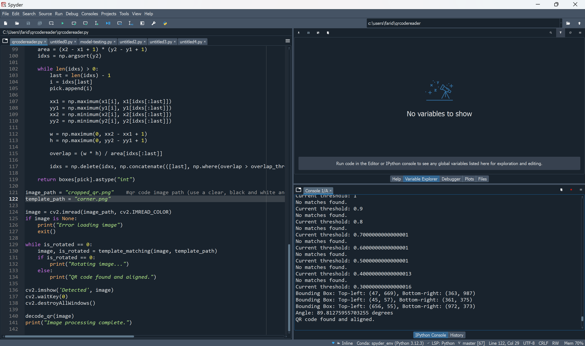
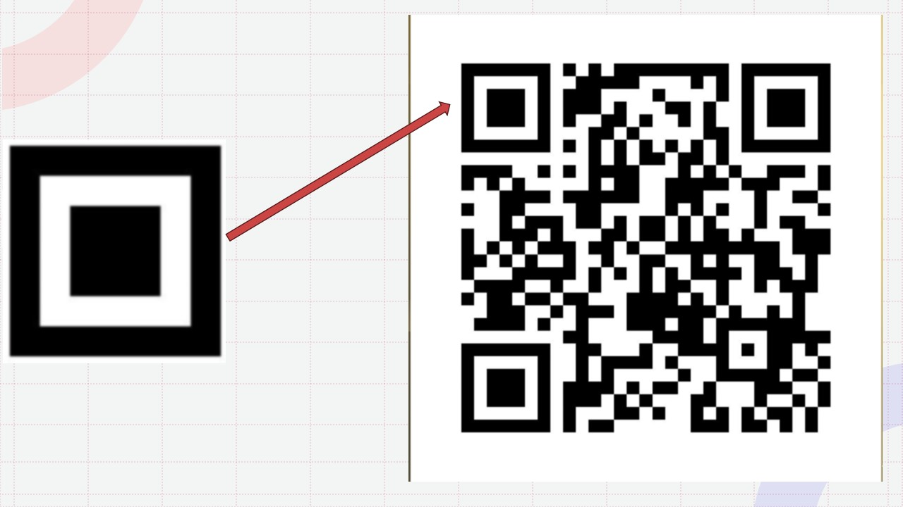
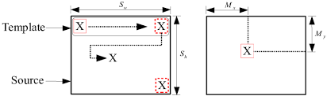

# **QR Code Reader with Template Matching and Rotation Detection**

This project provides a QR code reader that uses template matching and rotation detection to accurately decode QR codes from images, even when 
the QR code is rotated.

# **Features**

Template Matching: Identifies specific features in the image using a template and matches them to detect the position of the QR code.

Dynamically Adjusting threshold: Automatically adjusts the threshold using recursion to find the optimal threshold for detection.

Non-maximal Suppression: Reduces multiple matches in the same area to a single match by filtering largely overlapping bounding boxes.

Rotation Detection: Automatically detects if the QR code is rotated and corrects the orientation before decoding.

QR Code Decoding: Extracts and decodes the QR code data after ensuring the correct orientation.

# **Requirements**

Python 3

OpenCV

Pyzbar

Numpy

# **Usage**

Prepare your images:

Place the image containing the QR code in the qrcodereader directory. Update the image_path in the script to point to your QR code image , or use the existing qr code that takes you to your email.

# **Example Use**

Image is taken in misaligned at a different rotation, program automatically detects the rotation, rerotates it accordingly, prints the bounding boxes of the 3 corners and outputs the qr code data in the console.

# **Processing**

The template image (corner of a generic qr code) is scaled at different factors and by using the sliding window method over the target image, the sum of squared differences is calculated at each iteration and depending on the threshold level various matches will arise. By then using non maximal suppression to remove the overlapping matches and reduce them to singular matches, we then are left with 3 matches indicating the 3 corners we are looking for, then a rotation is applied to correct the rotation if necessary and then the image is decoded.

 

 
# **Display**

The script will display the processed image with bounding boxes around detected regions.

After processing, the decoded data will be printed in the console.

# **Code Overview**

decode_qr(image): Decodes the QR code data from the given image.

rotate_image(image, angle): Rotates the image by the specified angle.

template_matching(image, template_path, threshold): Performs template matching to detect features in the image and determine the correct orientation of the QR code.

non_max_suppression_fast(boxes, overlap_thresh): Applies non-maximum suppression to filter overlapping bounding boxes.

# **Contact**
If you have any questions or suggestions, feel free to contact Farid at farid.yous@ucdconnect.ie.

